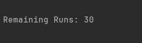
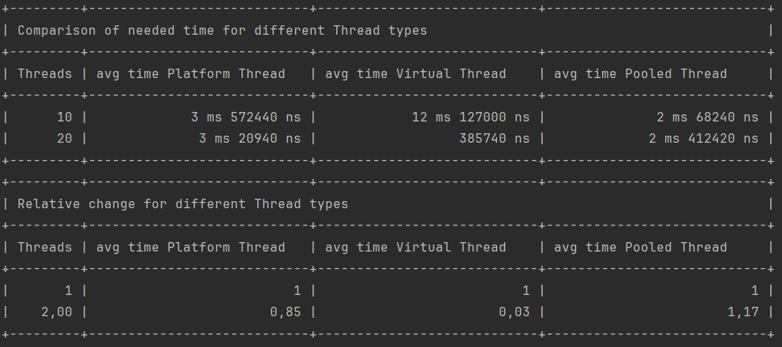
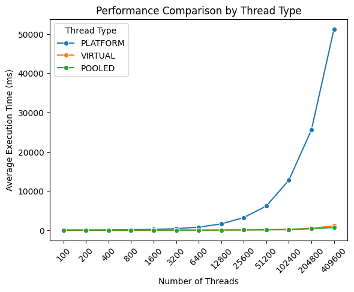
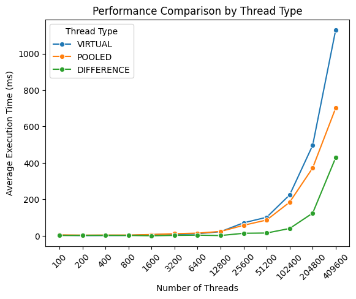
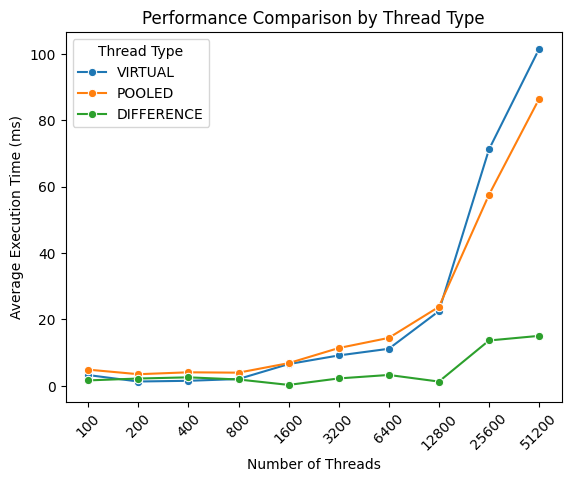
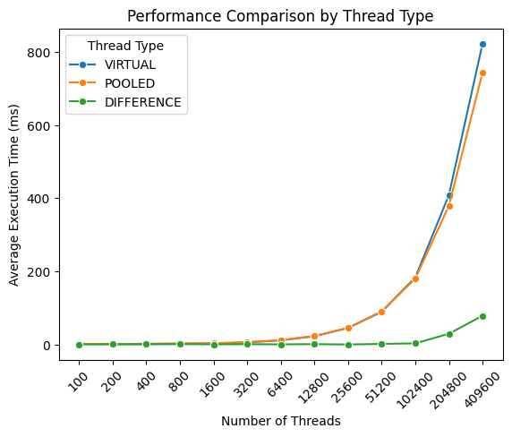

# Parallelität in Java

In dieser Arbeit werden verschiedene Threadtypen, die in Java bereitgestellt werden, verglichen. Dazu wird ein Programm geschrieben, dass mehrere Threads startet und die benötigte Zeit misst, bis alle Threads beendet wurden. Anhand dieser Messgröße wird die Performance der verschiedenen Threadtypen verglichen.

## Erläuterung der verschiedenen Threadtypen

## Eckdaten der benutzten Systeme

|                | System 1            | System 2   | System 3         |
|----------------|---------------------|------------|------------------|
| Betriebssystem | Windows 11          | Linux Mint | Windows 11       |
| Version        | 23H2 22631.3155     |            | 23H2 22631.3007  |
| CPU            | Intel Core i5-8250U |            | AMD Ryzen 5 3600 |
| CPU-Kerne      | 4                   |            | 6                |

## Erläuterung des Programms

Das Programm führt mehrere Messreihen durch. Für eine Messreihe werden mehrere Threads gestartet. Jeder Thread führt dieselbe Rechenoperation durch, eine Primfaktorzerlegung der Zahl 87654321. Dabei wird die Zeit gemessen von Erstellung der Threads bis alle Threads beendet werden. Dieser Ablauf wird für alle Threadtypen durchgeführt. Zusätzlich kann eine Messreihe mehrfach für eine unterschiedliche Anzahl an Threads durchgeführt werden. Um zufällige Schwankungen durch andere Prozesse des Systems möglichst abzufangen und belastbare Werte zu erhalten, wird jede Messung mehrfach wiederholt und der Durchschnitt der benötigten Zeit gebildet. Beide Werte sind in eine Config Datei ausgelagert und können beim Start des Programms angepasst werden.

Der Ablauf ist wie folgt. Nach dem Start des Programms zeigt es die aktuell eingestellten Default´Werte an und bietet dem Nutzer die Möglichkeit diese zu ändern. Dabei kann für die Anzahl der Threads eine Komma-separierte Liste an positiven Ganzzahlen eingegeben werden und für die Anzahl der Wiederholungen eine ebenfalls positive Ganzzahl. Alternativ kann für die Werte auch Enter gedrückt werden und der aktuelle Default Wert übernommen werden. Das bietet eine einfache Möglichkeit nur einen der Werte zu ändern. Anschließend wird noch einmal die geänderte Konfiguration angezeigt, die verwendet wird.

 
*Ausschnitt aus dem Programmablauf zum Ändern der Konfiguration.*

Das Programm führt dann die Messung durch. Es werden für jede Threadanzahl und für jeden Threadtyp mehrere Messungen, die der Anzahl der Wiederholungen entsprechen durchgeführt. Die Werte aus der Abbildung als Beispiel nehmend würden also zunächst 10 Betriebssystemthreads erstellt. Dies wird 5-mal wiederholt. Anschließend werden 10 virtuelle Threads erstellt und dies 5-mal wiederholt. Zum Schluss wird ein Threadpool erstellt und diesem 10 Runnables übergeben. Auch dies wird 5-mal wiederholt. Erst wenn dies abgeschlossen ist, wird der Prozess mit 20 Threads bzw. Runnables wiederholt.

 
*Ausschnitt aus dem Programmablauf. Anzeige der verbleibenden Messungen.*

Um einen ungefähren Überblick zu geben, wie lange das Programm noch läuft, wird angezeigt wie viele Messreihen noch durchgeführt werden. Dies entspricht *Anzahl an unterschiedlichen Threadanzahlen \* Anzahl Threadtypen \* Anzahl Wiederholungen*, für das Beispiel also *2 \* 3 \* 5 = 30*. Diese Zahl wird nach jeder abgeschlossenen Messreihe aktualisiert. Hierbei ist zu vermerken, dass Messreihen mit einer großen Anzahl an Threads länger benötigen, als solche mit wenigen Threads. Auf eine Aktualisierung nach jedem abgeschlossenen Thread wurde verzichtet, um die Messung nicht zu stören.

 
*Ausschnitt aus dem Programmablauf. Die Ergebnisse der Messungen werden in zwei Tabellen angezeigt.*

Nach Abschluss der Messungen werden die Ergebnisse angezeigt. In der ersten Tabelle werden die Ergebnisse in menschenlesbarer Form nach Threadtyp und Threadanzahl aufgeschlüsselt. Um in dieser simplen Übersicht erste Zusammenhänge erkennen zu können, wird in einer zweiten Tabelle die Änderungsrate zur vorherigen Tabellenzeile angezeigt. Im Beispiel verdoppelt sich die Threadanzahl, während die benötigte Zeit für Pooled Threads ungefähr gleich geblieben ist.

 
*Ausschnitt aus dem Programmablauf. Die Ergebnisse können im CSV-Format in einer Datei gespeichert werden.*

Zum Abschluss des Programms können die Ergebnisse noch im CSV-Format in einer Datei gespeichert werden. Das ermöglicht es in Nachgang weitere Analysen durchzuführen. Der Speicherort und der Dateiname kann dabei selbst gewählt werden.

## Auswertung

Um die Ergebnisse auszuwerten, wird die exportierte CSV-Datei in ein Python Jupyter Notebook eingelesen. Die Daten werden dann in einem Diagramm visualisiert. Für jeden Threadtyp wird eine eigene Kurve in das Diagramm eingezeichnet. Auf der x-Achse werden die Durchläufe anhand der Anzahl der gestarteten Threads abgetragen. Da bei den höheren Werten zunehmend größere Abstände vorhanden sind, wird die x-Achse der besseren Übersichtlichkeit wegen, mit gleichmäßigen Abständen skaliert. Auf der y-Achse wird die ermittelte durchschnittliche Laufzeit abgetragen.

Zunächst werden die Ergebnisse von System 1 (Windows) betrachtet.

 
*Vergleich der Performance aller Threadtypen (System 1).*

In diesem Diagramm ist deutlich zu sehen, dass die benötigte Laufzeit bei den Betriebssystemthreads (blau) sehr viel schneller ansteigt, als bei den anderen beiden Typen. Dadurch sind die Unterschiede zwischen den anderen Typen kaum sichtbar. Lediglich bei der höchsten Anzahl an Threads ist erkennbar, dass die Kurven auseinanderlaufen. Daher werden als nächstes nur die virtuellen Threads und die Threadpools betrachtet.

 
*Vergleich der Performance von Virtual Threads und Threadpools (System 1).*

Betrachtet man nur die Kurven zu virtuellen Threads und zu den Threadpools können die Unterschiede zwischen diesen besser erkannt werden. Bei einer großen Anzahl an Threads liegt der Unterschied zwischen den beiden Threadtypen bei mehreren hundert Millisekunden. Der Unterschied zwischen den Typen nimmt mit steigender Anzahl von Threads zu. Hier haben Threadpools (orange) Vorteile und weisen die geringere Laufzeit auf.

 
*Ausschnitt aus dem Vergleich der Performance von Virtual Threads und Threadpools (System 1).*

Betrachtet man einen kleineren Ausschnitt des Diagramms, kann man sehen, dass dies nicht für alle Messpunkte gilt. Für eine geringe Anzahl an Threads liegt der Unterschied zwischen diesen Threadtypen bei ungefähr 2ms. Dabei weisen, im Gegensatz zur höheren Threadzahl, die virtuellen Threads die bessere Performance auf.

Nun werden dazu die Ergebnisse aus System 3 (Windows) im Vergleich betrachtet.

 
*Vergleich der Performance aller Threadtypen (System 3).*

Wie auch bei System 1 sind die Betriebssystemthreads wesentlich weniger performant als virtuelle Threads und Threadpools. Die benötigte Zeit ist im Vergleich zu System 1 geringer, da es sich bei System 3 um das stärkere System handelt.

 
*Vergleich der Performance von Virtual Threads und Threadpools (System 3).*

 
*Ausschnitt aus dem Vergleich der Performance von Virtual Threads und Threadpools (System 3).*

Auch die benötigte Zeit für die virtuellen Threads ist geringer als bei System 1. Die Performance von virtuellen Threads und Threadpools ist dabei praktisch gleich. Der Unterschied beträgt nur wenige Millisekunden. Obwohl es sich bei System 3 um das stärkere System handelt und der Unterschied bei den Betriebssystemthreads 20s beträgt, ist die benötigte Zeit für Threadpools auf beiden Systemen ungefähr gleich.

## GraalVM

Mithilfe von GraalVM können Java Programme in native Anwendungen kompiliert werden. Laut eigener Aussage sind diese von GraalVM erstellten Binärdateien kleiner, starten schneller und benötigen weniger Speicher und CPU als Anwendungen, die die Java Virtual Machine nutzen. [GraalVM Overview](https://www.graalvm.org/latest/docs/introduction/)

GraalVM wird nach der Anleitung für [Windows](https://www.graalvm.org/latest/docs/getting-started/windows/) bzw. [Linux](https://www.graalvm.org/latest/docs/getting-started/linux/) installiert. Für Windows muss GraalVM selbst installiert werden und entsprechende Umgebungsvariablen gesetzt werden. Zusätzlich ist eine Installation von Visual Studio erforderlich. Für Linux sind, abhängig von der Distribution, neben GraalVM einige zusätzliche Pakete erforderlich.

Nach der Installation kann dann die native Anwendung generiert werden. Dafür stehen verschiedene Möglichkeiten zur Verfügung. Für diese Arbeit wurde die Anwendung aus einer JAR-Datei erstellt. Dafür wird der Konsolenbefehl `native-image -jar jarfile <filename>` genutzt.

## Aufgetretene Schwierigkeiten

**FEHLT NOCH**
nur kleiner Ausschnitt betrachtet, angenommen Unterschied liegt in Initialisierung zunächst nur klein falsch angenommen, dass Pooled Threads schlechter

Bei der Umwandlung der jar Datei in eine native Windowsanwendung kam es zunächst zu Problemen. Soll GraalVM native Anwendungen für Windows erstellen, wird dafür wie beschrieben zusätzlich eine Installation von Visual Studio. Die ersten Versuche eine native Anwendung zu erstellen, schlugen jedoch fehl. Die folgende Fehlermeldung wurde angezeigt.

 
*Fehlermeldung beim Erstellen eines nativen Images auf Windows.*

GraalVM kann das installierte Visual Studio nicht finden. Um die native Anwendung erstellen zu können, muss der Befehl in der "x64 Native Tools Command Prompt for VS 2022" ausgeführt werden. Diese kann direkt über die Windows Suche gestartet werden.

Auch beim Erstellen der nativen Anwendung auf Linux kam es zu Problemen. Die jar Datei lag dabei auf einem USB-Stick. Da GraalVM die erstellte Anwendung im selben Verzeichnis speichert, wurde diese ebenfalls auf dem USB-Stick gespeichert. Dabei konnte GraalVM nicht die korrekten Berechtigungen setzen. Die Datei war dadurch nicht ausführbar. Die Datei musste zuerst auf das Linux-Dateisystem kopiert werden und dann mit `chmod +x <filename>` ausführbar gemacht werden. Bei einem zweiten Versuch, bei dem die Jar-Datei zuerst auf das Linux-Dateisystem kopiert wurde, konnte GraalVM die richtigen Berechtigungen setzen.

## Auswertung der Ergebnisse der nativen Anwendungen

Entgegen der Erwartung waren die Ergebnisse mit der durch GraalVM generierten nativen Anwendung auf Windows in allen Versuchen schlechter als mit der Jar-Datei. Dies kann auch im folgenden Diagramm gesehen werden. Das Diagramm zeigt den Vergleich zwischen den virtuellen Threads und den Threadpools auf System 1 (Windows). Auch auf System 3 waren die Ergebnisse mit der nativen Anwendung schlechter.

 
*Ergebnisse für Virtual Threads und Threadpools mit der nativen Anwendung (System 1).*

## Fazit

## Ausblick
System 1 CPU auf 100%

System 2 exe CPU auf 35-40%
jar auf 60-85%