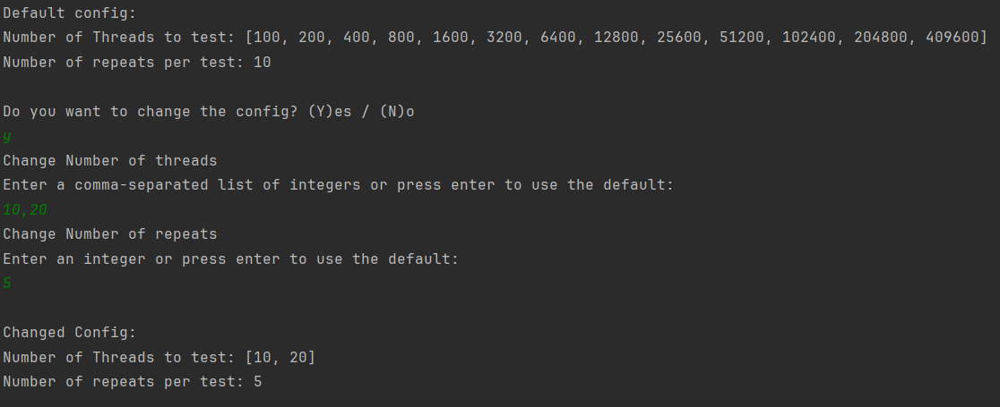

# Parallelität in Java

In dieser Arbeit werden verschiedene Threadtypen, die in Java bereitgestellt werden, verglichen. Dazu wird ein Programm geschrieben, dass mehrere Threads startet und die benötigte Zeit misst, bis alle Threads beendet wurden. Anhand dieser Messgröße wird die Performance der verschiedenen Threadtypen verglichen.

## Erläuterung der verschiedenen Threadtypen

## Erläuterung des Programms

Das Programm führt mehrere Messreihen durch. Für eine Messreihe werden mehrere Threads gestartet. Jeder Thread führt dieselbe Rechenoperation durch, eine Primfaktorzerlegung der Zahl 87654321. Dabei wird die Zeit gemessen von Erstellung der Threads bis alle Threads beendet werden. Dieser Ablauf wird für alle Threadtypen durchgeführt. Zusätzlich kann eine Messreihe mehrfach für eine unterschiedliche Anzahl an Threads durchgeführt werden. Um zufällige Schwankungen durch andere Prozesse des Systems möglichst abzufangen und belastbare Werte zu erhalten, wird jede Messung mehrfach wiederholt und der Durchschnitt der benötigten Zeit gebildet. Beide Werte sind in eine Config Datei ausgelagert und können beim Start des Programms angepasst werden.

Der Ablauf ist wie folgt. Nach dem Start des Programms zeigt es die aktuell eingestellten Default´Werte an und bietet dem Nutzer die Möglichkeit diese zu ändern. Dabei kann für die Anzahl der Threads eine Komma-separierte Liste an positiven Ganzzahlen eingegeben werden und für die Anzahl der Wiederholungen eine ebenfalls positive Ganzzahl. Alternativ kann für die Werte auch Enter gedrückt werden und der aktuelle Default Wert übernommen werden. Das bietet eine einfache Möglichkeit nur einen der Werte zu ändern. Anschließend wird noch einmal die geänderte Konfiguration angezeigt, die verwendet wird.

 
*Ausschnitt aus dem Programmablauf zum Ändern der Konfiguration.*

Das Programm führt dann die Messung durch. Es werden für jede Threadanzahl und für jeden Threadtyp mehrere Messungen, die der Anzahl der Wiederholungen entsprechen durchgeführt. Die Werte aus der Abbildung als Beispiel nehmend würden also zunächst 10 Betriebssystemthreads erstellt. Dies wird 5-mal wiederholt. Anschließend werden 10 virtuelle Threads erstellt und dies 5-mal wiederholt. Zum Schluss wird ein Threadpool erstellt und diesem 10 Runnables übergeben. Auch dies wird 5-mal wiederholt. Erst wenn dies abgeschlossen ist, wird der Prozess mit 20 Threads bzw. Runnables wiederholt.

 
*Ausschnitt aus dem Programmablauf. Anzeige der verbleibenden Messungen.*

Um einen ungefähren Überblick zu geben, wie lange das Programm noch läuft, wird angezeigt wie viele Messreihen noch durchgeführt werden. Dies entspricht *Anzahl an unterschiedlichen Threadanzahlen \* Anzahl Threadtypen \* Anzahl Wiederholungen*, für das Beispiel also *2 \* 3 \* 5 = 30*. Diese Zahl wird nach jeder abgeschlossenen Messreihe aktualisiert. Hierbei ist zu vermerken, dass Messreihen mit einer großen Anzahl an Threads länger benötigen, als solche mit wenigen Threads. Auf eine Aktualisierung nach jedem abgeschlossenen Thread wurde verzichtet, um die Messung nicht zu stören.

 
*Ausschnitt aus dem Programmablauf. Die Ergebnisse der Messungen werden in zwei Tabellen angezeigt.*

## Auswertung

Um die Ergebnisse auszuwerten, wird die exportierte CSV-Datei in ein Python Jupyter Notebook eingelesen. Die Daten werden dann in einem Diagramm visualisiert. Für jeden Threadtyp wird eine eigene Kurve in das Diagramm eingezeichnet. Auf der x-Achse werden die Durchläufe anhand der Anzahl der gestarteten Threads abgetragen. Da bei den höheren Werten zunehmend größere Abstände vorhanden sind, wird die x-Achse der besseren Übersichtlichkeit wegen, zunächst logarithmisch skaliert. Auf der y-Achse wird die ermittelte durchschnittliche Laufzeit abgetragen.

In diesem Diagramm ist deutlich zu sehen, dass die benötigte Laufzeit bei den Betriebssystemthreads (blau) sehr viel schneller ansteigt, als bei den anderen beiden Typen. Dadurch sind die Unterschiede zwischen den anderen Typen kaum sichtbar. Lediglich bei der höchsten Anzahl an Threads ist erkennbar, dass die Kurven auseinanderlaufen. Daher werden als nächstes nur die virtuellen Threads und die Threadpools betrachtet.

Betrachtet man nur die Kurven zu virtuellen Threads und zu den Threadpools können die Unterschiede zwischen diesen besser erkannt werden. Die Performanceunterschiede zwischen diesen beiden Threadtypen sind jedoch weiterhin gering. Bei einer großen Anzahl an Threads liegt der Unterschied zwischen diesen bei mehreren hundert Millisekunden. Der Unterschied zwischen den Typen nimmt mit steigender Anzahl von Threads zu. Hier haben Threadpools (orange) Vorteile und weisen die geringere Laufzeit auf.

*abc*

Betrachtet man einen kleineren Ausschnitt des Diagramms, kann man sehen, dass dies nicht für alle Messpunkte gilt.

## GraalVM

## Aufgetretene Schwierigkeiten

nur kleiner Ausschnitt betrachtet, angenommen Unterschied liegt in Initialisierung

Graal VM: Besondere prompt notwendig, falsche Rechte wegen USB-Stick: musste erst rüber kopiert werden und dann auf ausführbar gesetzt werden

## Fazit