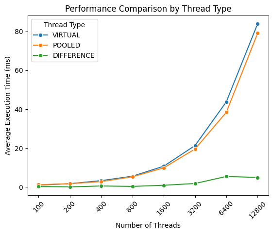
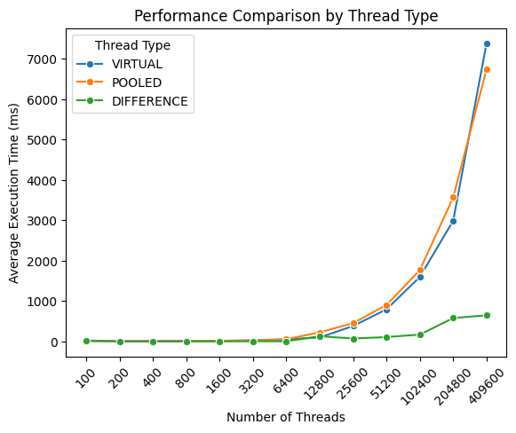
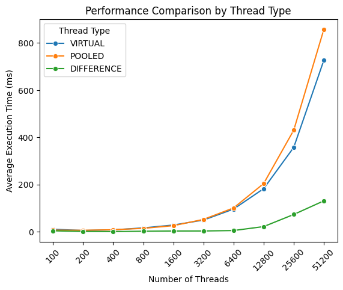
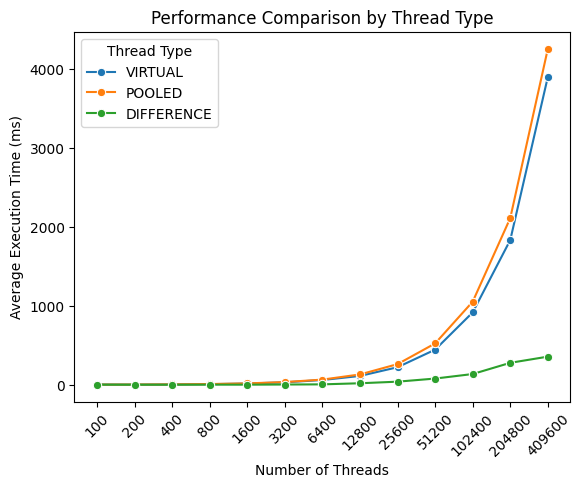
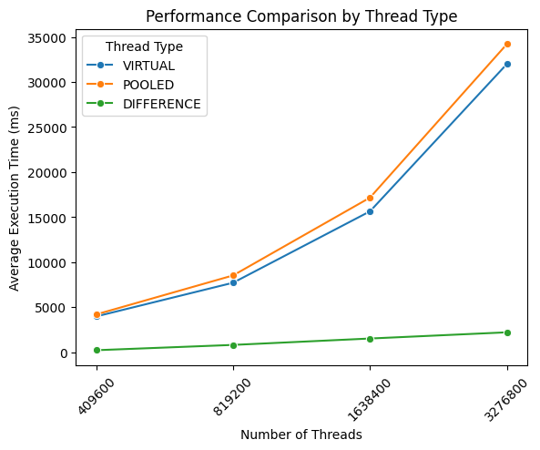
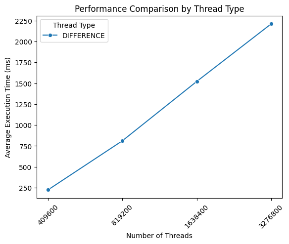
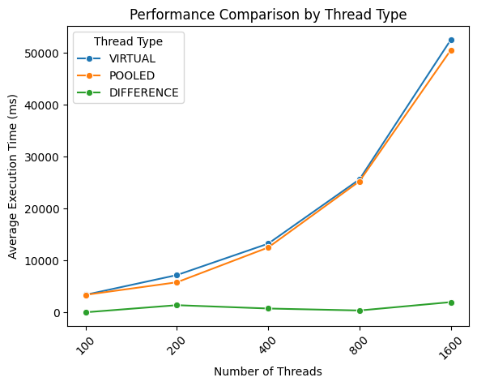
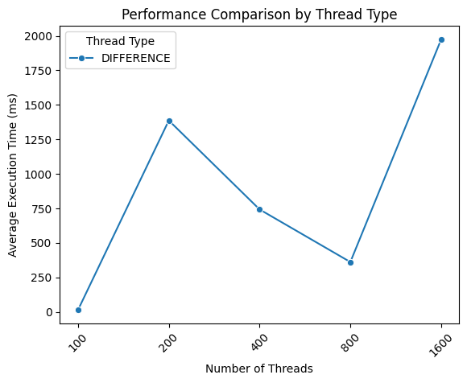
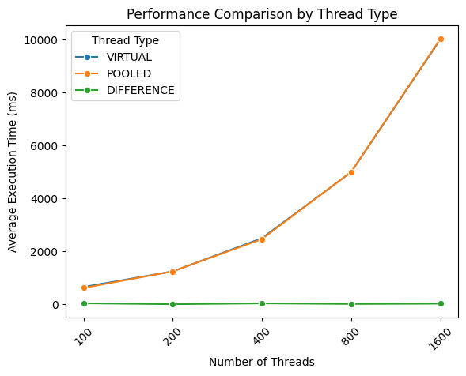
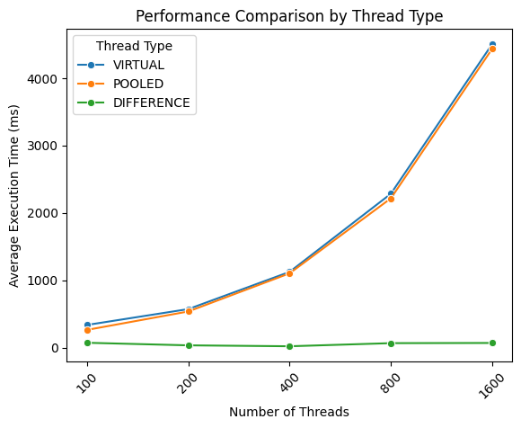

# Parallelität in Java

In dieser Arbeit werden verschiedene Threadtypen, die in Java bereitgestellt werden, verglichen. Dazu wird ein Programm geschrieben, dass mehrere Threads startet und die benötigte Zeit misst, bis alle Threads beendet wurden. Anhand dieser Messgröße wird die Performance der verschiedenen Threadtypen verglichen.

## Eckdaten der benutzten Systeme

Das entwickelte Programm werden auf verschiedenen Systemen ausgeführt und Ergebnisse gemessen. Die Eckdaten der verschiedenen Systeme können der Tabelle entnommen werden.

|                 | System 1            | System 2            | System 3         |
|-----------------|---------------------|---------------------|------------------|
| Betriebssystem  | Windows 11          | Linux Mint          | Windows 11       |
| Version         | 23H2 22631.3155     | 20.2 "Uma" Cinnamon | 23H2 22631.3007  |
| CPU             | Intel Core i5-8250U | Intel Core i3-330M  | AMD Ryzen 5 3600 |
| CPU-Kerne       | 4                   | 2                   | 6                |

## Erläuterung des Programms

Das Programm führt mehrere Messreihen durch. Für eine Messreihe werden mehrere Threads gestartet. Jeder Thread führt dieselbe Rechenoperation durch, eine Primfaktorzerlegung der Zahl 87654321. Dabei wird die Zeit gemessen von Erstellung der Threads bis alle Threads beendet werden. Dieser Ablauf wird für alle Threadtypen durchgeführt. Zusätzlich kann eine Messreihe mehrfach für eine unterschiedliche Anzahl an Threads durchgeführt werden. Um zufällige Schwankungen durch andere Prozesse des Systems möglichst abzufangen und belastbare Werte zu erhalten, wird jede Messung mehrfach wiederholt und der Durchschnitt der benötigten Zeit gebildet. Beide Werte sind in eine Config Datei ausgelagert und können beim Start des Programms angepasst werden.

Der Ablauf ist wie folgt. Nach dem Start des Programms zeigt es die aktuell eingestellten Default´Werte an und bietet dem Nutzer die Möglichkeit diese zu ändern. Dabei kann für die Anzahl der Threads eine Komma-separierte Liste an positiven Ganzzahlen eingegeben werden und für die Anzahl der Wiederholungen eine ebenfalls positive Ganzzahl. Alternativ kann für die Werte auch Enter gedrückt werden und der aktuelle Default Wert übernommen werden. Das bietet eine einfache Möglichkeit nur einen der Werte zu ändern. Anschließend wird noch einmal die geänderte Konfiguration angezeigt, die verwendet wird.

 
*Ausschnitt aus dem Programmablauf zum Ändern der Konfiguration.*

Das Programm führt dann die Messung durch. Es werden für jede Threadanzahl und für jeden Threadtyp mehrere Messungen, die der Anzahl der Wiederholungen entsprechen durchgeführt. Die Werte aus der Abbildung als Beispiel nehmend würden also zunächst 10 Betriebssystemthreads erstellt. Dies wird 5-mal wiederholt. Anschließend werden 10 virtuelle Threads erstellt und dies 5-mal wiederholt. Zum Schluss wird ein Threadpool erstellt und diesem 10 Runnables übergeben. Auch dies wird 5-mal wiederholt. Erst wenn dies abgeschlossen ist, wird der Prozess mit 20 Threads bzw. Runnables wiederholt.

 
*Ausschnitt aus dem Programmablauf. Anzeige der verbleibenden Messungen.*

Um einen ungefähren Überblick zu geben, wie lange das Programm noch läuft, wird angezeigt wie viele Messreihen noch durchgeführt werden. Dies entspricht *Anzahl an unterschiedlichen Threadanzahlen \* Anzahl Threadtypen \* Anzahl Wiederholungen*, für das Beispiel also *2 \* 3 \* 5 = 30*. Diese Zahl wird nach jeder abgeschlossenen Messreihe aktualisiert. Hierbei ist zu vermerken, dass Messreihen mit einer großen Anzahl an Threads länger benötigen, als solche mit wenigen Threads. Auf eine Aktualisierung nach jedem abgeschlossenen Thread wurde verzichtet, um die Messung nicht zu stören.

 
*Ausschnitt aus dem Programmablauf. Die Ergebnisse der Messungen werden in zwei Tabellen angezeigt.*

Nach Abschluss der Messungen werden die Ergebnisse angezeigt. In der ersten Tabelle werden die Ergebnisse in menschenlesbarer Form nach Threadtyp und Threadanzahl aufgeschlüsselt. Um in dieser simplen Übersicht erste Zusammenhänge erkennen zu können, wird in einer zweiten Tabelle die Änderungsrate zur vorherigen Tabellenzeile angezeigt. Im Beispiel verdoppelt sich die Threadanzahl, während die benötigte Zeit für Pooled Threads ungefähr gleich geblieben ist.

 
*Ausschnitt aus dem Programmablauf. Die Ergebnisse können im CSV-Format in einer Datei gespeichert werden.*

Zum Abschluss des Programms können die Ergebnisse noch im CSV-Format in einer Datei gespeichert werden. Das ermöglicht es in Nachgang weitere Analysen durchzuführen. Der Speicherort und der Dateiname kann dabei selbst gewählt werden.

## Auswertung

Um die Ergebnisse auszuwerten, wird die exportierte CSV-Datei in ein Python Jupyter Notebook eingelesen. Die Daten werden dann in einem Diagramm visualisiert. Für jeden Threadtyp wird eine eigene Kurve in das Diagramm eingezeichnet. Auf der x-Achse werden die Durchläufe anhand der Anzahl der gestarteten Threads abgetragen. Da bei den höheren Werten zunehmend größere Abstände vorhanden sind, wird die x-Achse der besseren Übersichtlichkeit wegen, mit gleichmäßigen Abständen skaliert. Auf der y-Achse wird die ermittelte durchschnittliche Laufzeit abgetragen.

Zunächst werden die Ergebnisse von System 1 (Windows) betrachtet.

 
*Vergleich der Performance aller Threadtypen (System 1).*

In diesem Diagramm ist deutlich zu sehen, dass die benötigte Laufzeit bei den Betriebssystemthreads (blau) sehr viel schneller ansteigt, als bei den anderen beiden Typen. Dadurch sind die Unterschiede zwischen den anderen Typen kaum sichtbar. Lediglich bei der höchsten Anzahl an Threads ist erkennbar, dass die Kurven auseinanderlaufen. Daher werden als nächstes nur die virtuellen Threads und die Threadpools betrachtet.

 
*Vergleich der Performance von Virtual Threads und Threadpools (System 1).*

Betrachtet man nur die Kurven zu virtuellen Threads und zu den Threadpools können die Unterschiede zwischen diesen besser erkannt werden. Bei einer großen Anzahl an Threads liegt der Unterschied zwischen den beiden Threadtypen bei mehreren hundert Millisekunden. Der Unterschied zwischen den Typen nimmt mit steigender Anzahl von Threads zu. Hier haben Threadpools (orange) Vorteile und weisen die geringere Laufzeit auf. Der Unterschied beträgt mehr als 400ms für die höchste Threadzahl.

 
*Ausschnitt aus dem Vergleich der Performance von Virtual Threads und Threadpools (System 1).*

Betrachtet man einen kleineren Ausschnitt des Diagramms, kann man sehen, dass dies nicht für alle Messpunkte gilt. Für eine geringe Anzahl an Threads liegt der Unterschied zwischen diesen Threadtypen bei ungefähr 2ms. Dabei weisen, im Gegensatz zur höheren Threadzahl, die virtuellen Threads die bessere Performance auf.

Nun werden dazu die Ergebnisse aus System 3 (Windows) im Vergleich betrachtet.

 
*Vergleich der Performance aller Threadtypen (System 3).*

Wie auch bei System 1 sind die Betriebssystemthreads wesentlich weniger performant als virtuelle Threads und Threadpools. Die benötigte Zeit ist im Vergleich zu System 1 geringer, da es sich bei System 3 um das stärkere System handelt.

 
*Vergleich der Performance von Virtual Threads und Threadpools (System 3).*

 
*Ausschnitt aus dem Vergleich der Performance von Virtual Threads und Threadpools (System 3).*

Auch die benötigte Zeit für die virtuellen Threads ist geringer als bei System 1. Die Performance von virtuellen Threads und Threadpools ist dabei praktisch gleich. Der Unterschied beträgt nur wenige Millisekunden. Obwohl es sich bei System 3 um das stärkere System handelt und der Unterschied bei den Betriebssystemthreads bereits im Bereich von mehreren Sekunden liegt, ist die benötigte Zeit für Threadpools auf beiden Systemen ungefähr gleich.

Die Ergebnisse von System 2 ähneln denen der anderen beiden Systemen. Die tatsächlichen Werte sind insgesamt höher, was auch zu erwarten war, da es sich bei System 2 um das älteste und schwächste System handelt.

 
*Vergleich der Performance aller Threadtypen (System 2).*

Auch auf System 2 benötigen die Betriebssystemthreads mehr Laufzeit als die alternativen Threadtypen.

 
*Vergleich der Performance von Virtual Threads und Threadpools (System 2).*

 
*Ausschnitt aus dem Vergleich der Performance von Virtual Threads und Threadpools (System 2).*

Die Werte zwischen virtuellen Threads und Threadpools laufen wie bei System 1 mit einer höheren Threadzahl auseinander. Der Unterschied ist jedoch nicht so stark ausgeprägt wie bei System 1 und liegt bei der höchsten Threadzahl bei ungefähr 250ms. Auch bei diesem System ist zu beobachten, dass virtuelle Threads bei einer niedrigeren Anzahl an Threads eine bessere Performance aufweisen und dies sich erst mit steigender Threadzahl umkehrt. Aufgrund der höheren Werte wurde ein kleinerer Ausschnitt gewählt als bei den anderen beiden Systemen um das Diagramm einfacher auswerten zu können.

## GraalVM

Mithilfe von GraalVM können Java Programme in native Anwendungen kompiliert werden. Laut eigener Aussage sind diese von GraalVM erstellten Binärdateien kleiner, starten schneller und benötigen weniger Speicher und CPU als Anwendungen, die die Java Virtual Machine nutzen. [GraalVM Overview](https://www.graalvm.org/latest/docs/introduction/)

GraalVM wird nach der Anleitung für [Windows](https://www.graalvm.org/latest/docs/getting-started/windows/) bzw. [Linux](https://www.graalvm.org/latest/docs/getting-started/linux/) installiert. Für Windows muss GraalVM selbst installiert werden und entsprechende Umgebungsvariablen gesetzt werden. Zusätzlich ist eine Installation von Visual Studio erforderlich. Für Linux sind, abhängig von der Distribution, neben GraalVM einige zusätzliche Pakete erforderlich.

Nach der Installation kann dann die native Anwendung generiert werden. Dafür stehen verschiedene Möglichkeiten zur Verfügung. Für diese Arbeit wurde die Anwendung aus einer JAR-Datei erstellt. Dafür wird der Konsolenbefehl `native-image -jar jarfile <filename>` genutzt.

## Aufgetretene Schwierigkeiten

Während der Entwicklung und ersten Tests wurde nur eine geringe Zahl an Threads verwendet. Dabei wurde wie auch in der Auswertung beschrieben erkannt, dass die virtuellen Threads eine geringere Laufzeit aufweisen als die Threadpools. Weiterhin lag die Differenz zwischen diesen beiden Threadtypen für jeden Messpunkt ungefähr auf derselben Höhe. Daher wurde die Theorie entwickelt, dass virtuelle Threads und Threadpools dieselbe Performance aufweisen. Der Unterschied wurde damit erklärt, das Threadpools etwas länger für die Initialisierung benötigen. Als eine größere Zahl von Threads getestet wurde, musste diese Hypothese verworfen werden.

Bei der Umwandlung der jar Datei in eine native Windowsanwendung kam es zunächst zu Problemen. Soll GraalVM native Anwendungen für Windows erstellen, wird dafür wie beschrieben zusätzlich eine Installation von Visual Studio. Die ersten Versuche eine native Anwendung zu erstellen, schlugen jedoch fehl. Die folgende Fehlermeldung wurde angezeigt.

 
*Fehlermeldung beim Erstellen eines nativen Images auf Windows.*

GraalVM kann das installierte Visual Studio nicht finden. Um die native Anwendung erstellen zu können, muss der Befehl in der "x64 Native Tools Command Prompt for VS 2022" ausgeführt werden. Diese kann direkt über die Windows Suche gestartet werden.

Auch beim Erstellen der nativen Anwendung auf Linux kam es zu Problemen. Die jar Datei lag dabei auf einem USB-Stick. Da GraalVM die erstellte Anwendung im selben Verzeichnis speichert, wurde diese ebenfalls auf dem USB-Stick gespeichert. Dabei konnte GraalVM nicht die korrekten Berechtigungen setzen. Die Datei war dadurch nicht ausführbar. Die Datei musste zuerst auf das Linux-Dateisystem kopiert werden und dann mit `chmod +x <filename>` ausführbar gemacht werden. Bei einem zweiten Versuch, bei dem die Jar-Datei zuerst auf das Linux-Dateisystem kopiert wurde, konnte GraalVM die richtigen Berechtigungen setzen.

## Auswertung der Ergebnisse der nativen Anwendungen

Entgegen der Erwartung waren die Ergebnisse mit der durch GraalVM generierten nativen Anwendung auf Windows in allen Versuchen schlechter als mit der Jar-Datei. Dies kann auch im folgenden Diagramm gesehen werden. Das Diagramm zeigt den Vergleich zwischen den virtuellen Threads und den Threadpools auf System 1 (Windows). Auch auf System 3 waren die Ergebnisse mit der nativen Anwendung schlechter.

 
*Ergebnisse für Virtual Threads und Threadpools mit einer nativen Anwendung unter Windows (System 1).*

Im Gegensatz dazu stehen die Ergebnisse auf System 2 mit einer nativen Linux Anwendung. Die benötigte Zeit für Betriebssystemthreads sank um ungefähr die Hälfte.

 
*Ergebnisse für die native Anwendung unter Linux (System 2).*

Die Ergebnisse für virtuelle Threads und Threadpools haben sich durch den Einsatz der nativen Anwendung allerdings kaum verändert. Lediglich bei niedrigeren Threadzahlen lässt sich eine Verbesserung erkennen.

 
*Ergebnisse für Virtual Threads und Threadpools mit einer nativen Anwendung unter Linux (System 2).*

 
*Ausschnitt aus den Ergebnissen für Virtual Threads und Threadpools mit einer nativen Anwendung unter Linux (System 2).*

## Fazit

Nach Auswertung der Ergebnisse muss vom Einsatz von Betriebssystemthreads abgeraten werden. Diese wiesen in allen Systemen eine deutlich schlechtere Laufzeit auf als die alternativen Threadtypen. Bestehende Anwendungen, die diese nutzen, sollten umgestellt werden. Aufgrund der ähnlichen Verwendung bieten sich hier die virtuellen Threads an.

Zu der Frage, ob virtuelle Threads oder Threadpools eingesetzt werden sollten, lässt sich leider keine klare Aussage treffen. Die Ergebnisse von System 1 und System 2 zeigen das Threadpools vor allem bei hohen Threadzahlen eine bessere Performance aufweisen. Bei einer niedrigeren Anzahl an Threads weisen jedoch virtuelle Threads eine leicht bessere Performance auf. Bei Anwendungen bei denen mit hohen Spitzen an Threads zu rechnen könnte es sich daher lohnen mit einem einmal erstellten Threadpool zu arbeiten. Anwendungen die auf ihre Laufzeit gesehen viele Threads starten, diese sich jedoch über die Laufzeit verteilen, könnten dagegen von virtuellen Threads profitieren.

Dabei ist auch zu bedenken, dass die Verwaltung eines Threadpools etwas aufwändiger ist als virtuelle Threads. Während virtuelle Threads nach Bedarf erstellt werden können, muss der Threadpool einmalig initialisiert werden und anschließend in einer Variablen gespeichert werden. Um neue Threads auszuführen, muss zuerst auf den bereits existierenden Threadpool zugegriffen werden. System 3 zeigt, dass mit zunehmender Leistung des Systems die Unterschiede zwischen diesen beiden Typen zunehmend verschwinden. Für Serveranwendungen könnte diese Fragestellung daher irrelevant sein. 

Hier besteht ein Ansatzpunkt für weitergehende Untersuchungen. Es könnte untersucht werden, ob sich diese Vermutung für Systeme die auf starke Nebenläufigkeit ausgelegt sind bestätigt. Je nach Quelle laufen ein großer Teil oder die Mehrheit der Server mit dem Betriebssystem Linux ([[1]](https://6sense.com/tech/server-and-desktop-os), [[2]](https://www.t4.ai/industry/server-operating-system-market-share), [[3]](https://www.fortunebusinessinsights.com/server-operating-system-market-106601)). Für Serveranwendungen könnte sich daher ein genauerer Blick auf die Performance unter Linux lohnen. Obwohl das im Test verwendete System 2 mit Linux schwächer als System 1 war, war der Unterschied zwischen virtuellen Threads und Threadpools geringer als auf System 1. Auf aktuellerer Hardware könnten die Unterschiede zwischen diesen beiden Threadtypen ebenfalls irrelevant sein. Zudem könnte untersucht werden, ob es Unterschiede zwischen verschiedenen Distributionen gibt.

Vom Einsatz von GraalVM unter Windows muss nach den erzielten Ergebnissen abgeraten werden. Die Performance mit der nativen Anwendung war deutlich schlechter als mit der Jar-Datei. Unter Linux kann GraalVM eingesetzt werden. Die Performance verbessert sich dadurch jedoch nur marginal. Hier könnte ebenfalls angesetzt werden und weiterführend untersucht werden, ob durch andere Optionen doch eine Verbesserung erzielt werden kann.

## Nachträgliche Änderungen

### Warm-Up

Vor der eigentlichen Messreihe wird nun ein Warm-Up der Java Virtual Machine (JVM) ausgeführt. Die Annahme dabei ist, dass die ersten Messergebnisse durch ein fehlendes Warm-Up verfälscht werden. Daher werden jetzt zuerst einige Threads gestartet, die nicht in die Messungen mit einfließen. Durch das Warm-Up ändert sich jedoch nichts an der grundlegende Verteilung. 

### Blocking Operations

Eine weitere Idee war, dass blockierende Operationen zu Unterschieden zwischen Threadpools und virtuellen Threads führen könnten. Da bei Threadpools nur eine geringe festgelegte Zahl an Threads parallel ablaufen, könnten blockierende Aufrufe, wie z.B. Dateisystemzugriffe, den Threadpool an sich blockieren, wenn alle Threads im Pool warten. Die Idee hier ist das bei virtuellen Threads die Ressourcenverwaltung besser funktioniert, und während dem warten andere Threads laufen können. 

Um dies zu testen wurden zwei zusätzliche Funktionen implementiert. Einmal wird eine künstliche Knappheit mit einer Semaphore erzeugt, bei der zweiten Funktion wird ein tatsächlicher Dateizugriff durchgeführt. Bei der ersten Funktion führen die Threads zunächst wie gewohnt die Faktorisierung durch. Nach der Berechnung versuchen die Threads eine Sperre bei einer Semaphore anzumelden. Sind noch Kontigente frei, so wird der Programmablauf fortgeführt. Erhält ein Thread kein Kontigent mehr, muss er warten bis ein anderer Thread seine Sperre freigibt. Dadurch laufen maximal x Threads parallel. Nach dem ein Thread eine Sperre erlangt hat, führt er abermals eine Faktorisierung durch und gibt die Sperre dann wieder frei.
Bei der zweiten Funktion führen die Threads wieder zunächst eine Faktorisierung durch. Anschließend erstellen sie eine eigene Datei, die mit einem zufälligen String beschrieben wird. Diese Datei wird nachdem sie geschlossen wurde wieder gelöscht.

#### Ergebnisse für die Semaphore

Mit der Semaphore ändert sich der Abstand zwischen virtuellen Threads und Threadpools für die höchste Threadzahl bei System 1 kaum. Bei verschiedenen Durchläufen verbesserte und verschlechterte er sich nur marginal. Der Vorteil für Threadpools tritt allerdings später ein als bei der Faktorisierung. Bei der zweithöchsten Threadanzahl haben virtuelle Threads noch einen Vorteil von mehreren hundert Millisekunden.

 
*Ergebnisse mit einer künstlichen Verknappung durch eine Semaphore unter Windows (System 1). Durch das andere Skalenniveau (im Vergleich zur Faktorisierung) wirken die Ergebnisse näher beieinander als sie tatsächlich sind.*

Für System 2 konnte dagegen eine deutliche Verbesserung gegenüber den Threadpools erzielt werden. Der Vorteil der virtuellen Threads liegt bei nahezu einer Sekunde.

 
*Ergebnisse mit einer künstlichen Verknappung durch eine Semaphore unter Linux (System 2).*

Auch bei System 3 weisen die virtuellen Threads eine geringere Laufzeit auf als Threadpools. Dabei nimmt der Vorteil für höhere Threadzahlen zu.

 
*Ergebnisse mit einer künstlichen Verknappung durch eine Semaphore unter Windows (System 3).*

Für System 3 wurde noch einmal eine erweiterte Messung durchgeführt. Hier ist ersichtlich, dass sich der Vorteil von virtuellen Threads fortsetzt. Die Differenz liegt für höhere Threadzahlen schnell im Sekundenbereich.

 
*Ergebnisse mit einer künstlichen Verknappung durch eine Semaphore unter Windows (System 3). Die Messung wurde mit höheren Threadzahlen durchgeführt*

 
*Differenz zwischen virtuellen threads und Threadpools mit einer künstlichen Verknappung durch eine Semaphore unter Windows (System 3). Die Messung wurde mit höheren Threadzahlen durchgeführt*

#### Ergebnisse für die Dateioperationen

Aufgrund der hohen Laufzeit der Funktion mit Dateioperationen wird eine geringere Zahl an Threads betrachtet. Bei System 1 kann kein Vorteil von virtuellen Threads gegenüber Threadpools erkannt werden. Sie weisen für alle Threadanzahlen eine höhere Laufzeit auf.

 
*Ergebnisse mit Dateioperationen unter Windows (System 1).*

Betrachtet man die Differenz in einem eigenen Diagramm ist ersichtlich, dass es keinen Trend gibt. Die Differenz springt stark umher. Es gibt also vermutlich noch andere Faktoren, die die Laufzeiten bei System 1 beeinflussen.

 
*Differenz zwischen der Laufzeit von virtuellen Threads und Threadpools mit Dateioperationen unter Windows (System 1).*

Für System 2 ist die Laufzeit bei virtuellen Threads und Threadpools mit Dateioperationen praktisch identisch.

 
*Ergebnisse mit Dateioperationen unter Linux (System 2).*

Auch bei System 3 ist die Laufzeit bei virtuellen Threads und Threadpools nahezu identisch, wobei Threadpools eine etwas geringere Laufzeit haben haben. Es gibt jedoch bei System 3 kaum Unterschiede zu der einfachen Faktorisierung. 

 
*Ergebnisse mit Dateioperationen unter Windows (System 3).*

